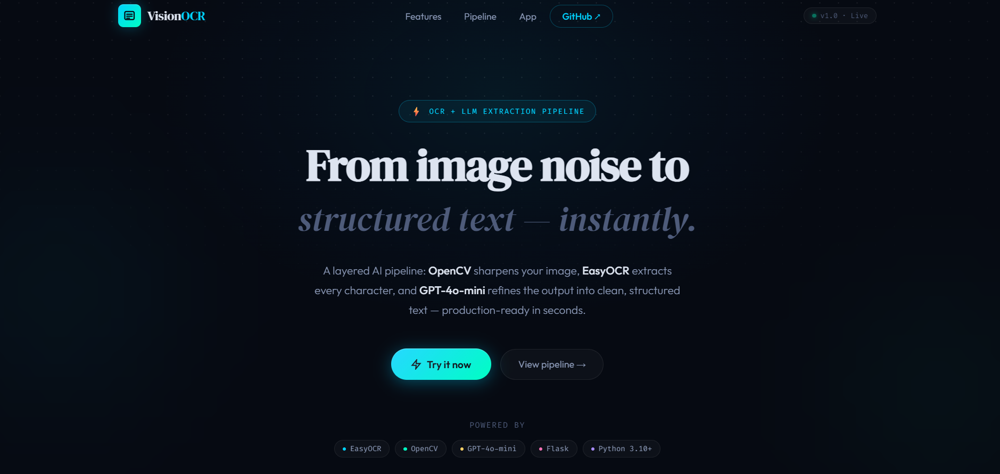
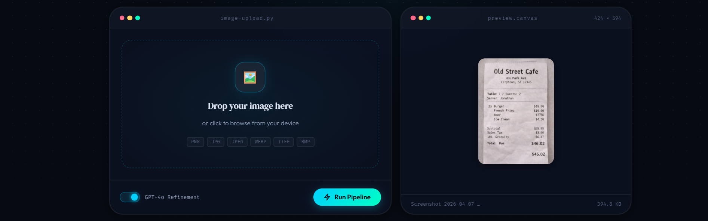
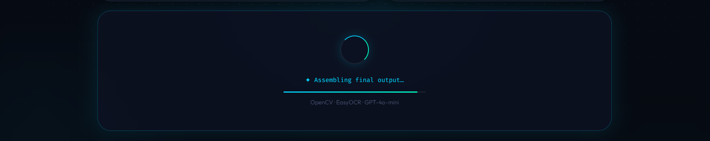
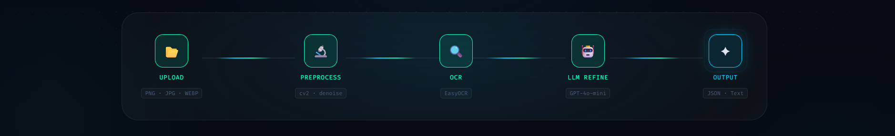
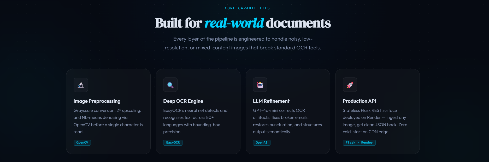
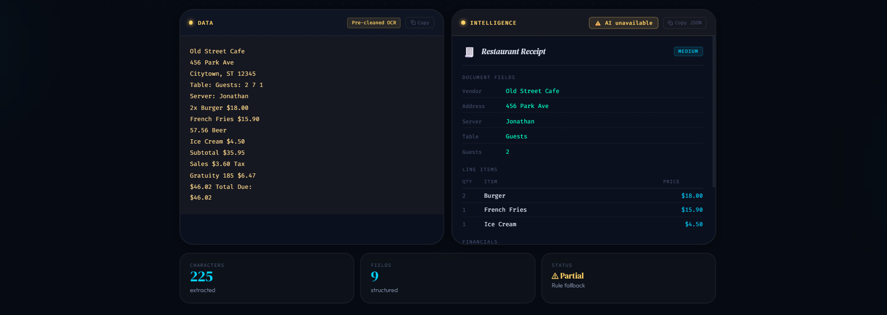

<<<<<<< HEAD
# 🧠 Image-to-Text LLM

[](https://python.org)
[](https://flask.palletsprojects.com)
[](https://openai.com)
[](https://opencv.org)
[](https://render.com)
[](LICENSE)
[](https://github.com/MdRayyanKalkoti)
[](https://github.com/MdRayyanKalkoti)

---

## 🔍 Overview

**Image-to-Text LLM** is a production-grade AI pipeline that bridges the gap between raw image data and structured, human-readable output. It combines **EasyOCR** for multilingual text extraction, **OpenCV** for image preprocessing and enhancement, and the **OpenAI API** for intelligent post-processing — transforming noisy, unstructured image text into clean, contextually accurate results.

Unlike simple OCR wrappers, this system is architected as a layered pipeline: preprocessing sharpens and denoises images before OCR fires, and an optional LLM refinement layer corrects OCR artifacts, infers structure, and formats the final output for downstream use.

Built to handle real-world images — invoices, handwritten notes, scanned forms, screenshots — with a clean REST API surface, a browser-accessible frontend, and deployment-ready infrastructure.

---

## 🌍 Real-World Use Cases

| Domain | Application |
|---|---|
| 🏦 Finance | Automated invoice and receipt digitization for ERP pipelines |
| 🏥 Healthcare | Scanned prescription and medical form extraction |
| 📦 Logistics | Parcel label and waybill OCR for tracking systems |
| 📄 Legal & Compliance | Digitizing signed contracts and printed legal documents |
| 🎓 Education | Converting scanned textbooks and handwritten notes to searchable text |
| 🛂 Identity Verification | Extracting fields from government-issued IDs and passports |

---

## ⚡ Features

- **Engineered a multi-stage image preprocessing pipeline** using OpenCV — grayscale conversion, adaptive thresholding, and noise reduction — to maximize OCR accuracy on low-quality inputs
- **Integrated EasyOCR** for robust multilingual text detection supporting 80+ languages without requiring additional language model downloads
- **Designed an optional LLM refinement layer** using OpenAI GPT API to correct OCR errors, reconstruct broken sentences, and structure extracted data into clean output
- **Built a stateless REST API** with Flask that accepts image uploads and returns structured text, ready for integration with any frontend or data pipeline
- **Shipped a browser-accessible UI** via Jinja2 templates, enabling direct image upload and result display without any external frontend framework
- **Optimized for production** with environment-based config, structured error handling, and clean separation of preprocessing, OCR, and LLM logic
- **Deployed on Render** with auto-scaling infrastructure and environment variable management via the platform dashboard

---

## 🛠️ Tech Stack

| Layer | Technology | Purpose |
|---|---|---|
| **Backend** | Python 3.10+, Flask | REST API server, routing, and template rendering |
| **OCR Engine** | EasyOCR | Deep learning-based text detection and recognition |
| **Image Processing** | OpenCV | Preprocessing, denoising, adaptive thresholding |
| **LLM Refinement** | OpenAI GPT API | Post-processing, error correction, output structuring |
| **Frontend** | HTML + Jinja2 (Flask Templates) | Browser UI for image upload and result display |
| **Deployment** | Render | Cloud hosting and auto-scaling |
| **CDN (Optional)** | Cloudflare Pages | Static frontend delivery with global edge network |
| **Environment Config** | python-dotenv | Secure secret and config management |

---

## 📁 Project Structure

```
image-to-text-llm/
│
├── app.py                  # Core Flask app — routes, OCR logic, LLM integration
├── requirements.txt        # Python dependencies
├── render.yaml             # Render deployment config
├── .gitignore              # Excludes .env, uploads, __pycache__, etc.
├── .env.example            # Environment variable template (safe to commit)
├── LICENSE
├── README.md
│
├── docs/                   # UI screenshots for README documentation
│   ├── hero-ui.png
│   ├── upload_ui.png
│   ├── processing_ui.png
│   ├── pipeline-ui.png
│   ├── features-ui.png
│   └── output-ui.png
│
├── templates/
│   └── index.html          # Jinja2 frontend — upload form + result display
│
└── uploads/                # Temporary storage for incoming image files
```

> 💡 The core pipeline — image preprocessing, OCR, and LLM refinement — lives in `app.py`, keeping the codebase lean and self-contained for a single-service deployment.

---

## 🚀 Installation & Setup

### Prerequisites

- Python 3.10+
- pip
- An OpenAI API key

### 1. Clone the Repository

```bash
git clone https://github.com/MdRayyanKalkoti/image-to-text-llm.git
cd image-to-text-llm
```

### 2. Create and Activate a Virtual Environment

```bash
python -m venv venv
source venv/bin/activate      # macOS/Linux
venv\Scripts\activate         # Windows
```

### 3. Install Dependencies

```bash
pip install -r requirements.txt
```

### 4. Configure Environment Variables

```bash
cp .env.example .env
# Open .env and fill in your API key
```

### 5. Run the Development Server

```bash
python app.py
```

Open your browser at `http://127.0.0.1:5000/` to access the upload interface.

---

## 🔐 Environment Variables

### `.env.example`

```env
# OpenAI API
OPENAI_API_KEY=sk-your-openai-api-key-here
OPENAI_MODEL=gpt-4o-mini

# OCR Configuration
OCR_LANGUAGES=en                  # Comma-separated language codes: en,fr,de,ar
LLM_REFINEMENT_ENABLED=true       # Toggle LLM post-processing on/off

# Upload Settings
MAX_CONTENT_LENGTH=10485760       # 10 MB max file size in bytes
UPLOAD_FOLDER=uploads/
ALLOWED_EXTENSIONS=png,jpg,jpeg,webp,tiff,bmp
```

> ⚠️ **Never commit your `.env` file.** It is excluded via `.gitignore` by default.

---

## 📡 API Endpoints

### `GET /`

Serves the browser-based upload interface (`index.html`).

---

### `POST /upload`

Accepts an image upload, runs the full preprocessing → OCR → optional LLM pipeline, and returns extracted text.

**Request**

```http
POST /upload
Content-Type: multipart/form-data

file: <image_file>
refine: true         # Optional — enable LLM refinement (default: false)
```

**Response — Success (`200 OK`)**

```json
{
  "status": "success",
  "raw_text": "Inv0ice #1O23\nDate: 01/O7/2O26",
  "refined_text": "Invoice #1023\nDate: 01/07/2026",
  "language_detected": "en",
  "processing_time_ms": 843
}
```

**Response — Error (`400 Bad Request`)**

```json
{
  "status": "error",
  "message": "No image file provided or unsupported format."
}
```

---

### `GET /health`

Liveness check for uptime monitoring and deployment verification.

**Response (`200 OK`)**

```json
{
  "status": "ok",
  "version": "1.0.0"
}
```

---

## 📸 Screenshots

### Hero — Landing Interface



---

### Upload — Image Input



---

### Processing — Pipeline in Action



---

### Pipeline — Architecture View



---

### Features — Capability Overview



---

### Output — Extracted & Refined Result



---

## ☁️ Deployment (Render)

This project is configured for zero-friction deployment on [Render](https://render.com).

### Steps

1. Push your repository to GitHub
2. Go to [render.com](https://render.com) → **New Web Service**
3. Connect your GitHub repository
4. Configure the service:

| Setting | Value |
|---|---|
| **Runtime** | Python 3 |
| **Build Command** | `pip install -r requirements.txt` |
| **Start Command** | `python app.py` |

5. Add all variables from `.env.example` under the **Environment** tab in the Render dashboard
6. Click **Deploy** — Render manages HTTPS, uptime, and scaling automatically

> 💡 For frontend delivery at the edge, pair with **Cloudflare Pages** for zero cold-start latency and a globally distributed CDN.
---

## 🌐 Live Demo

👉 [https://your-app.onrender.com](https://your-app.onrender.com)  
*(Replace with your live Render URL once deployed)*

---

## 💡 Why This Project Matters

OCR is a solved problem — but **accurate, production-ready OCR on noisy real-world images is not.**

Most off-the-shelf solutions fail on:
- Poor lighting, skew, or low-resolution scans
- Mixed-language documents
- OCR artifacts that produce garbled downstream output

This project solves all three by chaining image enhancement → OCR → LLM refinement into a single, composable pipeline. The LLM layer is not decorative — it acts as a semantic correction pass, recovering intent from OCR noise that rule-based cleanup would miss entirely.

The result is an **enterprise-applicable extraction system** that drops into document processing workflows, data pipelines, or compliance automation tooling — without custom model training or per-domain tuning.

---

## 🤝 Contributing

Pull requests are welcome. For significant changes, please open an issue first to discuss the proposed approach.

1. Fork the repository
2. Create a feature branch: `git checkout -b feature/your-feature`
3. Commit your changes: `git commit -m 'Add: your feature'`
4. Push and open a PR: `git push origin feature/your-feature`

---

## 👤 Author

**Md Rayyan**  
AI Engineer | Backend Developer

[](https://github.com/MdRayyanKalkoti)
[](https://linkedin.com/in/rayyan-kalkoti-bb5b35257/)

---

## 📄 License

This project is licensed under the [MIT License](LICENSE).

---

<p align="center">
  Built with precision by <a href="https://github.com/MdRayyanKalkoti">Md Rayyan</a> · Engineered for production, not portfolios.
</p>
=======
# image-to-text-llm
Production-ready Image-to-Text LLM app that extracts, processes, and analyzes text from images using AI. Built with Flask, optimized for real-world deployment on Render with secure environment handling.
>>>>>>> 46de7a780f47a50f03a622796717055be4a5a7de
